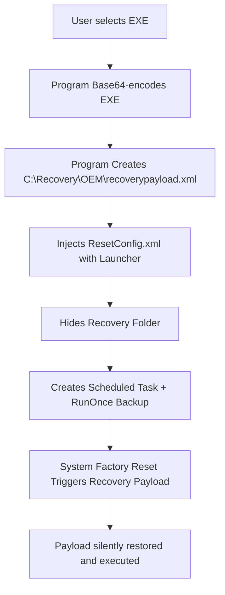

# 🛡️ WinRE Persistance - Payload Persistance.

---

## 🚀 Overview

**Reset Survival** is a fully coded C# tool designed to establish **persistence through Windows Factory Reset** mechanisms.

It encodes a user-specified payload (`.exe`) into Base64, embeds it within the Recovery Environment (`C:\Recovery\OEM`), modifies the `ResetConfig.xml`, and ensures **automatic payload execution** before, during, and after system recovery/reset operations.

---

## 🎯 Features

- **🔒 Recovery Persistence** — Survives factory resets and recovery reinstalls.
- **⚡ Instant Payload Execution** — Immediately after reset is completed.
- **🧬 Base64 Encoding** — Payloads encoded into readable XML.
- **🔧 Automated Directory Ownership** — Takes control of `C:\Recovery\OEM\`.
- **🎭 Full Stealth Mode** — No visible windows, no user prompts.
- **🛠️ Scheduled Tasks** — Persistence backup method via `schtasks`.
- **🧹 RunOnce Registry Key** — Emergency backup persistence method.
- **🧙 Hidden Recovery Directory** — Obfuscated from casual discovery.
- **🚀 PowerShell Launcher** — Embedded in ResetConfig for seamless execution.

---

## 🗺️ Flow Diagram



---

## ⚙️ How It Works

1. **Input**: Select your `.exe` payload.
2. **Encoding**: EXE is Base64 encoded and written to an XML file.
3. **Injection**:
   - Create/overwrite `ResetConfig.xml`.
   - Insert a stealthy PowerShell launcher that reconstructs and executes the payload.
4. **Persistence**:
   - Scheduled Task (high privilege) auto-triggers post-login.
   - Registry RunOnce key ensures execution on next boot.
5. **Post-Reset**:
   - Upon system reset completion, the recovery script decodes, restores, and launches the payload.

---

## 🔥 Full Tech Stack

| Component | Details |
|:--|:--|
| Language | C# (.NET Framework 4.8) |
| Recovery Dir | `C:\Recovery\OEM` |
| Files Dropped | `recoverypayload.xml`, `ResetConfig.xml`, `RecoveryRunner.exe` |
| Backup Persistence | Scheduled Task, RunOnce Registry Key |
| Execution Context | PowerShell decoded from Base64 |
| Privileges Needed | Administrator |

---

## 🚨 Legal Disclaimer

This tool is provided for **educational purposes only**.  
You are responsible for **how you use this tool**.  
Unauthorized access to computer systems is illegal.

**Intended Use Cases**:
- Red Team persistence frameworks
- Malware analysis / simulation environments
- Digital forensics research
- Self-repair recovery scripting

**Do not deploy** on devices or systems you do not own or have explicit permission to test.

---

## 🛠️ Setup

1. Clone the repo:
    ```bash
    git clone https://github.com/MpCmdRun/Reset-Survival
    cd recovery-injector
    ```

2. Open the solution in **Visual Studio 2019/2022**.

3. Build **Release** mode.

4. Run with **Administrator** privileges. (Could use a UAC Bypass!)

---

## 🧩 TODO

- [ ] GUI Version (WinForms/WPF)
- [ ] Obfuscation & Encryption of Base64 payloads
- [ ] AMSI Bypass for PowerShell execution
- [ ] Event Log Spoofing to hide traces
- [ ] Fileless Execution variant

---

## 👑 Credits

- Concept by @MpCmdRun
- Coded by @MpCmdRun
- Based on detailed Windows Recovery Architecture studies

---

## 💬 Questions / Suggestions?

Feel free to open an [Issue](https://github.com/MpCmdRun/Reset-Survival/issues) or [Pull Request](https://github.com/MpCmdRun/Reset-Survival/pulls).

---

# 💀 Reset Survival - Stay Persistent

---

# 📂 Example Folder Structure After Execution

```
C:\
 ├── Recovery\
 │    ├── OEM\
 │    │    ├── recoverypayload.xml
 │    │    └── ResetConfig.xml
 │    └── (Hidden Folder)
```
